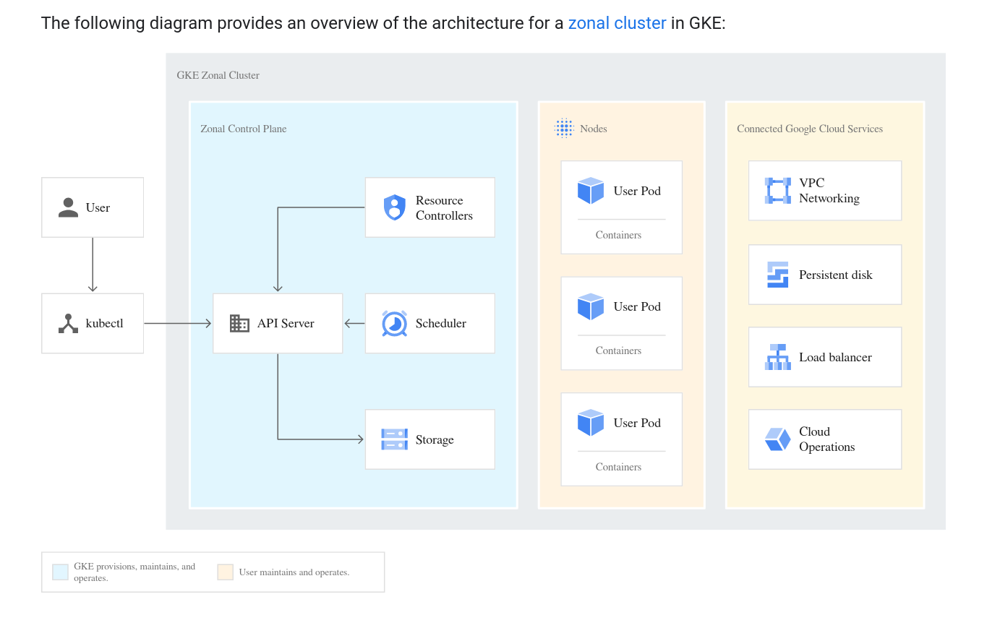

Kuberenetes Brown Bag
=====================

Notes and code snippets for the Kuberentes Brown Bags


Learn how to:

- create Kubernetes Clusters using gcloud.
- access Kubernetes Clusters and Namespaces using kubectl.
- deploy Docker containers to Kuberentes.
- organize Docker containers with Pods, BatchJobs, CronJobs, Deployments and StatefulSets.
- configure Docker containers with ConfigMaps and Secrets.
- expose Deployments to the Kuberentes cluster LAN and internet with Services.
- read container logs and gain shell access to containers.
- how to design portable Docker containers so they work well on Kubernetes or any other scheduler.


It is highly reccomended to go through the [K8S tutorials](https://kind.sigs.k8s.io/). They are well authored and useful. For a local K8Ss cluster use [kind](https://kind.sigs.k8s.io/).


Why Kuberentes ?
----------------

- Fast repeatable deployments.
- NFRs like autoscaling, loadbalanacing, secrets storage, log routing, metrics, config management are all built in.
- Industry standard that has been hardened by 100s of big companies.
- It makes your resume look nice.


Deploy a Kuberentes Cluster in GCP
----------------------------------


In GCP is is very easy to create a Kubernetes cluster.

```
gcloud config set project $PROJECT_ID
gcloud config set compute/zone $COMPUTE_ZONE
gcloud container clusters create hello-cluster --num-nodes=1
gcloud container clusters get-credentials hello-cluster
```

Hint: The above is automated idempotently in `./scripts/apply.sh` and `./scripts/delete.sh` so you can easily manage a small cluster lifecycle.
Just set a unique SUFFIX if it's a shared project.

```
export SUFFIX=k8s-$USER
./scripts/apply.sh
```




In order to manage Kubernetes resoureces we'll need to setup [kubectl](https://kubernetes.io/docs/tasks/tools/) on our computer and configure it correctly.

```
curl -LO "https://dl.k8s.io/release/$(curl -L -s https://dl.k8s.io/release/stable.txt)/bin/linux/amd64/kubectl"

gcloud container clusters get-credentials --zone "$GCP_ZONE" $CLUSTER_NAME
```

This installs `kubectl` and sets up `~/.kube/config` with the needs CAs and credential hooks to interact with your cluster.
```
cat ~/.kube/config
```


Kuberenetes Role Based Authorization
------------------------------------

It is highly reccomended to read the [Kubernetes RBAC documentation](https://kubernetes.io/docs/reference/access-authn-authz/rbac/).
Kubernetes controls access to resources via ClusterRoles and Roles.

ClusterRoles provide across the entire cluster. Think of them as the SuperUser
```
kubectl get ClusterRoles
```

Roles provide access to one or more Namespaces. Think of them as a regular user.
```
kubectl get Roles
```

Kuberentes collects objects into [Namespaces](https://kubernetes.io/docs/concepts/overview/working-with-objects/namespaces/). Think of each Namespace as $HOME in Kuberentes for the application.
```
kubectl get Namespaces
```

`kube-*` Namespaces are reserved for the Cluster Control Plane and are not normally accessed by users.


Kubernetes Verbs
----------------

get      - a list of basic info on specified objects.
describe - a list of details on specified objects.
create   - procedurally create the specified objects.
apply    - idempotently create the specified objects.
delete   - procedurally delete the specified objects.
logs     - get container logs from STDOUT|STDERR.
exec     - run a command in a container.


Kubernetes Pods and Deployments
-------------------------------

A Pod is a collection of Docker Containers that all share the same localhost and are all scheduled to the same kuberentes node. File paths can also be shared via mounts.

Helpful Links:
[K8s Pods](https://kubernetes.io/docs/concepts/workloads/pods/pod/)

Let's create a pod with 1 container and exec to the container.

simple-pod.yaml
```yaml
apiVersion: v1
kind: Pod
metadata:
  name: brownbag-pod
  labels:
    app: brownbag-pod1
spec:
  containers:
  - name: client
    image: centos:centos7
    command: ['/bin/bash', '-c', 'sleep 3600']
```

```bash
kubectl apply -f simple-pod.yaml
kubectl get pods
kubectl get pods brownbag-pod -o yaml
kubectl exec -it brownbag-pod -- /bin/bash
kubectl describe pods brownbag-pod
kubectl delete -f simple-pod.yaml
```

Let's create a pod with 2 containers and exec to the container, curl the
service and view the service container log.

composed-pod.yaml
```yaml
apiVersion: v1
kind: Pod
metadata:
  name: brownbag-pod2
  labels:
    app: brownbag-pod2
spec:
  containers:
  - name: client
    image: centos:centos7
    command: ['/bin/bash', '-c', 'sleep 3600']
  - name: server
    image: centos:centos7
    command: ['python', '-m', 'SimpleHTTPServer']
```

```bash
kubectl apply -f composed-pod.yaml
kubectl exec -it brownbag-pod --container client -- /bin/bash
curl localhost:8000/
exit
kubectl logs brownbag-pod server
kubectl delete -f composed-pod.yaml
```


ConfigMaps and Secrets
======================
ConfigMaps and Secrets are ways to configure pods are deploy time. If mount target is missing from the Namespace, Kublet will wait for it to be present before scheduling a pod. Kubernetes secrets are encrypted at rest so they are a secure storage.

Let's create a pod with a Secret and ConfigMap and exec to the container.

mounts-pod.yaml
```yaml
apiVersion: v1
kind: Pod
metadata:
  name: brownbag-pod
  labels:
    app: example
spec:
  containers:
  - name: client
    image: centos:centos7
    command: ['/bin/bash', '-c', 'sleep 3600']
    env:
      - name: EDITOR
        valueFrom:
          configMapKeyRef:
            name: config
            key: editor
    volumeMounts:
    - name: my-secret
      mountPath: "/secrets"
      readOnly: true
    - name: my-config
      mountPath: "/config"
      readOnly: true
  volumes:
  - name: my-secret
    secret:
      secretName: secret
  - name: my-config
    configMap:
      name: config
      items:
      - key: "config.properties"
        path: "config.properties"

---


apiVersion: v1
kind: Secret
metadata:
  name: secret
type: Opaque
data:
  .secret-file: |
        4oCcQmUgU3VyZSBUbyBEcmluayBZb3VyIE92YWx0aW5lLuKAnQo=


---


apiVersion: v1
kind: ConfigMap
metadata:
  name: config
data:
  editor: "vi"
  config.properties: |
    orchestrator=kubernetes
```

```bash
kubectl apply -f mounts-pod.yaml
kubectl exec -it brownbag-pod --container client -- /bin/bash
cat config/config.properties
env | grep ED
cat secrets/.secret-file
exit
kubectl delete -f mounts-pod.yaml
```


BatchJobs, CronJobs StatefulSets and Deployments
===================================

K8s offers several options to schedule pods in different ways

- BatchJobs offer a run to completion schedule for a pod.
  https://kubernetes.io/docs/concepts/workloads/controllers/jobs-run-to-completion/
- CronJobs allow run to completion at intervals defined in cron format.
  https://kubernetes.io/docs/concepts/workloads/controllers/cron-jobs/

- StatefulSets are for managing stateful applications like Databases, zookeeeper, consul, et al. https://kubernetes.io/docs/tutorials/stateful-application/basic-stateful-set/

- Deployments allow for pods to be used as services in a highly scalable fashion.
  They also facilitate rolling updates for pods during updates for the container or the underlying server instance.
  https://kubernetes.io/docs/concepts/workloads/controllers/deployment/

There are more types of ways to schedule pods documented under Controllers:
  https://kubernetes.io/docs/concepts/workloads/controllers/deployment/

Lets's create a deployment and access it via port-forwarding.

deployment.yaml
```yaml
apiVersion: apps/v1
kind: Deployment
metadata:
  name: brownbag-deployment
  labels:
    app: brownbag-deployment
spec:
  replicas: 1
  selector:
    matchLabels:
      app: brownbag-deployment
  template:
    metadata:
      labels:
        app: brownbag-deployment
    spec:
      containers:
      - name: server
        image: centos:centos7
        ports:
        - containerPort: 8000
        command: ['python', '-m', 'SimpleHTTPServer']
```

```bash
kubectl apply -f deployment.yaml
kubectl get deployment
kubectl get replicaset
kubectl get pods
export POD_NAME=$(kubectl get pods -o json | jq -r .items[0].metadata.name)
kubectl port-forward $POD_NAME 8000:8000
curl http://localhost:8000/
kubectl delete -f deployment.yaml
```


Services
--------

A Service is a way to expose a pods port outside of a namespace. Services select pods to forward traffic to based on labels and will loadbalance the requests if there is more than one pod matching the label spec.

Let's create a Deployment with a Service and access it from the Namespace.

service.yaml
```yaml
apiVersion: v1
kind: Service
metadata:
  name: brownbag-service
  labels:
    app: brownbag-service
spec:
  ports:
  - port: 80
    targetPort: 8000
    protocol: TCP
  selector:
    app: brownbag-deployment


---


apiVersion: apps/v1
kind: Deployment
metadata:
  name: brownbag-deployment
  labels:
    app: brownbag-deployment
spec:
  replicas: 1
  selector:
    matchLabels:
      app: brownbag-deployment
  template:
    metadata:
      labels:
        app: brownbag-deployment
    spec:
      containers:
      - name: server
        image: centos:centos7
        ports:
        - containerPort: 8000
        command: ['python', '-m', 'SimpleHTTPServer']
```

```bash
kubectl apply -f service.yaml
export POD_NAME=$(kubectl get pods -o json | jq -r .items[0].metadata.name)
kubectl exec -it $POD_NAME -- /bin/bash
curl http://brownbag-service/
kubectl delete -f service.yaml
```

Lets's access our service with a Public IP.

loadbalancer.yaml
```yaml
apiVersion: apps/v1
kind: Deployment
metadata:
  name: brownbag-deployment
  labels:
    app: brownbag-deployment
spec:
  replicas: 1
  selector:
    matchLabels:
      app: brownbag-deployment
  template:
    metadata:
      labels:
        app: brownbag-deployment
    spec:
      containers:
      - name: server
        image: centos:centos7
        ports:
        - containerPort: 8000
        command: ['python', '-m', 'SimpleHTTPServer']

---

apiVersion: v1
kind: Service
metadata:
  name: brownbag-service
  labels:
    app: brownbag-service
spec:
  type: LoadBalancer
  ports:
  - port: 80
    targetPort: 8000
    protocol: TCP
  selector:
    app: brownbag-deployment
```

```bash
kubectl apply -f loadbalancer.yaml
kubectl get services
export PUBLIC_IP=$(kubectl get services brownbag-service -o json | jq -r '.status.loadBalancer.ingress[0].ip')
curl -v http://$PUBLIC_IP/
kubectl delete -f loadbalancer.yaml
```


Docker Container Best Practices
===============================

Docker images should be portable, composable and externally configurable.

- Log to stdout. The scheduler should decide how to route logs. If special logic
  is required to route logs that the scheduler can't handle log to stdout in the
  app and have a "sidecar" container in the pod handle logs.

  TIP: if your logger is hard to change (gasp) link the files to stdout, stderr
  like the Nginx folks did:
  ```bash
  ln -sf /dev/stdout /var/log/nginx/access.log
  ln -sf /dev/stderr /var/log/nginx/error.log
  ```

- Only 1 process per container. Each container should have only a single pid 1
  process. Process managers like systemctl or supervisor should not be used, PID
  files should not be used. The scheduler should know when a process dies.
  Multi Process Applications should be composed of seperate containers just
  like abstractions in OOP or Functional programming.

- Make you containers externally configurable. Place config files with default
  values that "just work" in idoiomatic locations, or use default Environmental
  Variables. Then use the scheduler to override those values at deplo time with
  volume mounts or injected envs

- Don't reuse image tags like 'latest' or 'SNAPSHOT'. It leads to confusion when
  things change on users without warning.

  For unreleased versions use $SEMANTIC_VERSION-$TIME_IN_SECONDS-$GIT_SHORT_HAS
  hcr.data.here.com/3dds-arch/nearmap:0.0.3-1563890798-02643ee

  For release versions use just Semantic Version
  hcr.data.here.com/3dds-arch/nearmap:0.0.3

- Never run as root. Use `nobody` instead. Nobody's home is / and it makes
  things more secure.

- Keep images small. Don't copy things you don't need. Don't leave a mess of
  build artifacts and too many layers in your images. Use the builder pattern
  to leave cruft behind in the 'builder' container.

```
FROM golang:1.11.4 as builder
WORKDIR /nearmap
COPY . .
RUN make build


FROM centos:centos7

WORKDIR /
RUN yum -y install epel-release && \
    yum -y install gdal && \
    yum -y install ImageMagick.x86_64 && \
    yum -y clean all
COPY --chown=nobody:nobody --from=builder /nearmap/nearmap .
COPY --chown=nobody:nobody shapefiles /shapefiles/
COPY --chown=nobody:nobody docker_config.yaml /config.yaml
COPY --chown=nobody:nobody missingTile.jpg /missingTile.jpg
EXPOSE 1323
USER nobody:nobody
CMD ["./nearmap"]
```

Helpful links:
https://www.docker.com/blog/intro-guide-to-dockerfile-best-practices/
